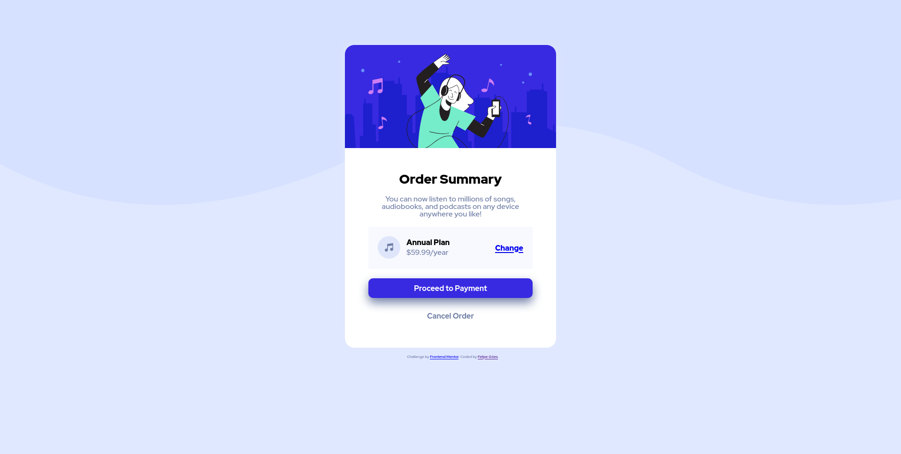

# Frontend Mentor - Order summary card solution

This is a solution to the [Order summary card challenge on Frontend Mentor](https://www.frontendmentor.io/challenges/order-summary-component-QlPmajDUj). Frontend Mentor challenges help you improve your coding skills by building realistic projects.

## Table of contents

- [Overview](#overview)
  - [The challenge](#the-challenge)
  - [Screenshot](#screenshot)
  - [Links](#links)
- [My process](#my-process)
  - [Built with](#built-with)
  - [What I learned](#what-i-learned)
  - [Continued development](#continued-development)
  - [Useful resources](#useful-resources)
- [Author](#author)
- [Acknowledgments](#acknowledgments)

## Overview

### The challenge

Users should be able to:

- See hover states for interactive elements

### Screenshot



### Links

- Solution URL: [https://felipe-goes.github.io/order-summary-card/](https://felipe-goes.github.io/order-summary-card/)
- GitHub URL: [https://github.com/felipe-goes](https://github.com/felipe-goes)

## My process

### Built with

- Semantic HTML5 markup
- CSS3 properties

### What I learned

In this project I was able to learn more about the `relative` and `absolute` positioning
in CSS and also could apply the `transition` property.

The positioning is show in the code below. I learned that in order to properly use the
`absolute` position, the parent element should be in `relative` position. This made
structuring the design much easier.

```
.card-plan {
  position: relative;
  background-color: #f8f9fe;
  padding: 20px;
}

.card-plan a {
  position: absolute;
  font-weight: 900;
  top: 37px;
  right: 20px;
}
```

It also was nice to use the `transition` property to give a nice effect when hovering the
button as you can see in the code below.

```
.card-content button {
  width: 100%;
  border: 0px;
  border-radius: 10px;
  box-sizing: border-box;
  box-shadow: 0px 10px 20px hsl(224, 23%, 55%);
  background-color: #382ae1;
  color: #fff;
  transition: background-color 500ms;
}
```

### Continued development

I want to continue focusing on the semantic tags of HTML5 and some cool animations
with CSS3. I also want to use Flexbox and work on a project where I can practice my
JavaScript skills.

### Useful resources

- [Alura](https://cursos.alura.com.br/user/ogoesfelipe) - I am mainly studying Frontend
development in this plataform.

## Author

- GitHub - [Felipe Góes](https://github.com/felipe-goes)
- Frontend Mentor - [@felipe-goes](https://www.frontendmentor.io/profile/felipe-goes)
- Twitter - [@felipeogoes](https://www.twitter.com/felipeogoes)
- LinkEdin - [https://www.linkedin.com/in/felipe-g%C3%B3es-02357331/](https://www.linkedin.com/in/felipe-g%C3%B3es-02357331/)
- Email - *ogoesfelipe@gmail.com*

## Acknowledgments

I wanted to suggest you watching some of the Kevin Powell videos on YouTube. [This video](https://www.youtube.com/watch?v=QqDH5sYzDS8)
made me find out about the Front Mentor page and got me here and also to thank him for
this.

I hope some of his videos will be helpful for you as much it was for me.
